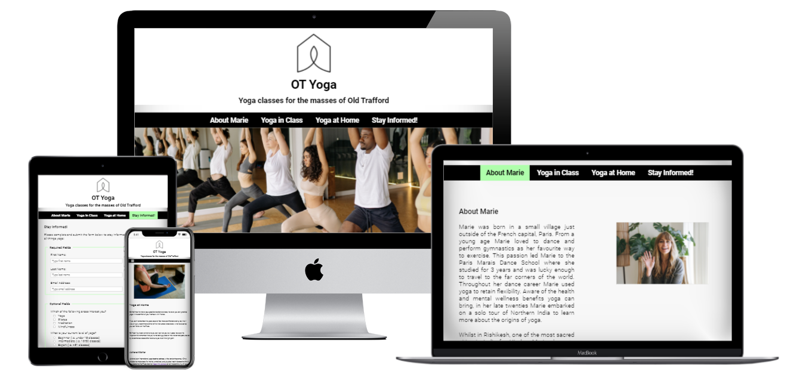
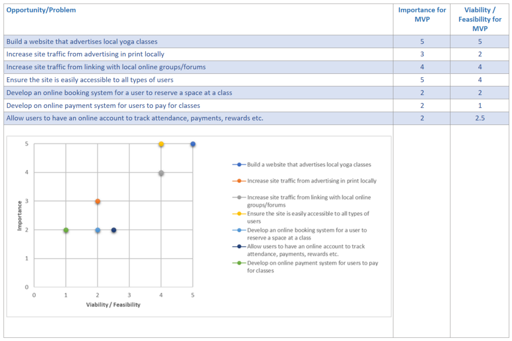
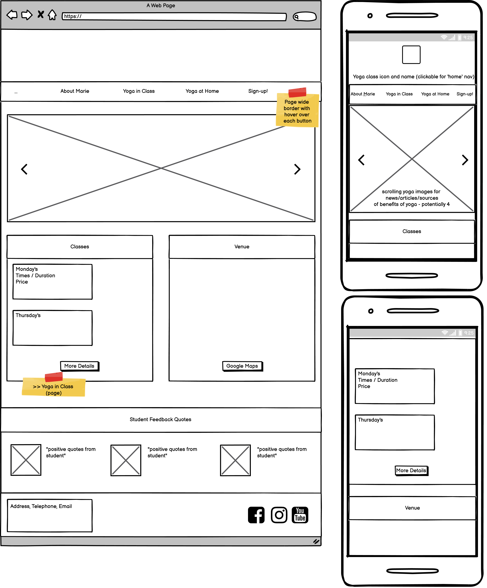
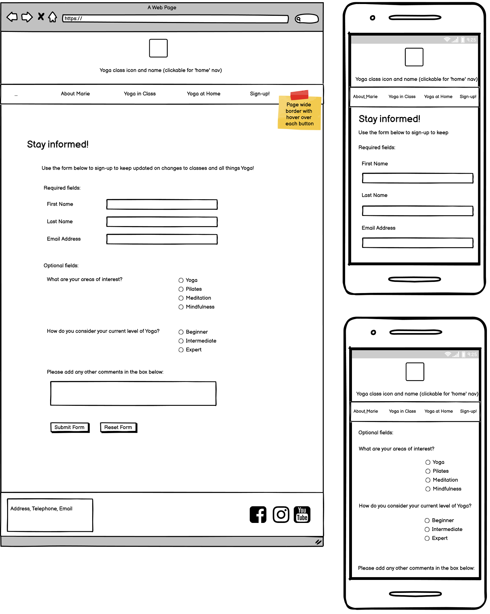
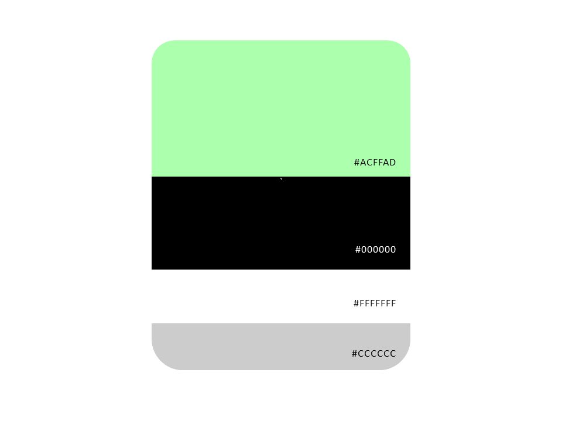

# OT Yoga

[Link to Live Website](https://rickofmanc.github.io/old-trafford-yoga/)

[GitHub Repo](https://github.com/RickofManc/old-trafford-yoga)

*** 

## About  

OT Yoga is a newly formed yoga class in Old Trafford, South Manchester. The classes have been established by Marie to guide people on stretching, energizing and relaxing as a community. The classes have become popular locally and so Marie would like to leverage this with an online presence where she can communicate to existing students and also increase the number of students attending. As well spreading positivity that yoga can bring into the community, and increase in attendees will help Marie fund the cost of the hiring the venue (which in turn supports other community projects).

***

## Index – Table of Contents

* [User Experience R&D](#user-experience-research-and-design)
     * [Strategy](#Strategy)
     * [Scope](#Scope)
     * [Structure](#Structure)
     * [Skeleton](#Skeleton)
     * [Surface](#Surface)
* [Features](#features)
* [Testing](#testing)
* [Deployment](#deployment)
* [Credits](#credit)

*** 

## User Experience Research and Design

### Strategy

The site will be targeted at all members of the community so accessibility in design is key as yoga can benefit anyone, no matter age or physically ability. The site will clearly inform students when and where classes take place, what to expect, and what to bring. Should a student be unable to attend a class there will be a section to support learning yoga at home.

#### Leading User Stories
* As a student with accessibility needs, I want to be able to intuitively navigate the website to learn all about OT Yoga, so that I can attend as part of regular exercise.
* As a student, I want to learn when and where yoga happens in Old Trafford/South Manchester, so that I can attend as part of regular exercise.
* As a student, I want to learn how much a yoga class costs and what I need to bring, so that I can be prepared when I attend a class.
* As a student, I want to learn what type of yoga is practiced, so I can understand if it will be something I would like to learn, or have practiced before.
* As a student, I want to learn about the instructor, so I can gauge whether we would get along.
* As a student, I would like to be kept informed of changes to classes, so I attend accordingly.

#### Primary strategic aims for the website
* Advertise yoga classes for the betterment of the local community.
* Advertise yoga classes to increase revenue to fund the cost of venue hire.
* Introduce a method for the instructor to communicate frequently with students.

The roadmap below highlights the high-level strategic opportunities versus the importance and viability/feasibility of development for the MVP (Minimal Viable Product):

### Scope

I adopted an agile approach of keeping the in scope features simple and aligned to the strategy for the MVP.
Here is a list of the in and out of scope features for this website.

#### In Scope Features
* Homepage that clearly informs what the site represents and offers.
* A menu that intuitively navigates to the other site pages.
* Imagery to help convey the aim of the website and individual pages.
* Provide information on; 
    * class days and time,
    * the venue and contact information,
    * the instructor,
    * types of yoga practiced,
    * feedback from current students,
    * sources for practicing yoga at home,
    * allow users to stay informed of changes to classes and other relating articles.

#### Out of Scope Features
* **Online booking system** the current venue is a large church hall with no indication that a class could hit the maximum occupancy of 40 persons when the MVP is launched. As interest and attendees grow then consideration may need to be given to adding a page for users to book in to avoid being disappointed if a class is full on arrival.
* **Online payment system** as an additional feature to follow or be developed with the 'Online booking system' users and the instructor could benefit from having a payment system to avoid having to handle and carry cash. Users could also block book for several classes at a time.
* **User accounts** users may benefit from having an account where they can track class attendance, payments and potential rewards i.e. every 10th class attended is free.
* **eCommerce** a page where users could purchase; yoga mats, towels, straps etc.

### Structure

This website will be structured with the following design considerations across 5 pages (including the homepage):
* The Information Architecture (IA) will follow a '3 Tier Hierarchical Tree Structure' approach.
* A homepage complete with navigation menu within the header, leading to pages for; About the Instructor, Yoga in Class, Yoga at Home and Stay Informed (sign-up page).
* The homepage header, navigation menu and footer will be consistent throughout the site. 
* To assist users, the homepage will display the essential information for the class days, times, type of yoga and cost. A button will be available to users to found out more information of what to expect when attending a class.
* To assist users, a map will be inset to the homepage so they can click through to help plan a route to attend a yoga class.
* Contact information and social media links will be located within the footer to support the strategic aim 'Introduce a method for the instructor to communicate frequently with students'.

### Skeleton

Key to this website being accessible to all members of the community was a design that is clear to read and intuitive to navigate. 
It was important to retain a clean and simple design throughout all pages to avoid confusing and ultimately marginalizing certain members of the community.

The homepage is the hub of the website where essential information is displayed. To support the users journey there is a logical navigation menu where answers to users questions can be found in a hope that it progressively reveals information in an order the user expects;
    * Who is teaching the yoga? click 'About Marie'.
    * What can I expect or need to bring? click 'Yoga in Class'.
    * If I can't attend a class, can I practice at home? click 'Yoga at Home'.
    * How can I stay in touch with OT Yoga? click 'Stay Informed!'.

As part of this phase I built wireframes for all pages using [Balsamiq](https://balsamiq.com/wireframes/) (see samples below). Consideration was given to both desktop and mobile users, with the final design being responsive at max screen widths of 640px, 980-1200px, 1200-1600px and +1600px - ensuring the website can be accessed as intended on any device or desktop monitor.

#### Homepage Wireframe 

#### Stay Informed! Wireframe

### Surface

In consideration that accessibility was a key design criteria, I've developed a visual language that offers contrast using simple colour palette, readable font and clear layout. Throughout the site this language has been applied consistently so using the site becomes intuitive with the most important links and information easily recognized.

#### Colour

Using [Color Hunt](https://colorhunt.co/) I researched for a colour that would offer a high contrast to the primarily monochrome theme. The light and bright Green selected offers that contrast whilst also being neutral in it's appeal to all genders. This was a key design consideration to ensure all genders within the community felt comfortable to join OT Yoga. 

#### Fonts

When researching typography the Proxima Nova font appeared to be common typography choice across websites praised for accessibility. With this in mind for the MVP I established Google Fonts' Roboto as the closet font to Proximo Nova available for free. Roboto was used as the only font across the website to promote a comfortable and consistent theme to users.

#### Images

For the MVP it wasn't feasible to produce photography from one of the classes when considering permissions for use of images inline with GDPR. Therefore the decision was taken to use free images from the web to communicate what the website represents. It was important to show differing ages and genders practicing yoga with just a mat. 

Images were sourced from [Pexels](https://pexels.com/) for the homepage and 'Yoga in Class' pages, whilst [RawPixel](https://rawpixel.com/) provided the images for the 'About Marie' and 'Yoga at Home' pages. All images have alt attributes and/or arial-label to support users with screen readers and the website ranking.

Where necessary images have been resized by width % and height rem to display on differing devices with max screens widths of 640px, 980-1200px, 1200-1600px and +1600px.

***

## Features

### Universal Features

##### Header & Navigation Menu

The centralized header element complete with OT Yoga logo and Navigation Menu (nav-menu) is a constant element throughout this website. The layout has been centrally aligned leading up to the logo to represent hands clasped stretching up, incorporating into a house. This sense of home is aimed at providing a friendly comfortable feel to users. The logo and main header change colour when the user hovers over them, with a click on either intuitively taking the user to the homepage.

The responsive nature of elements changing colour to the hight contrast shade of Green is carried over to the nav-menu where each page title changes on hover, and remains lit when a user visits that page to help inform where they are within the website.

On smaller devices under 640px wide, the nav-menu reduces to a collapsible drop-down style, with the options aligned to the left for ease of selection for the vast majority of users.

##### Footer 

Continuing the white font of black background theme of the universal nav-menu, the footer aims to be complimentary without distracting users from page content. The footers role on this website is to inform of how to contact, find and socialize with OT Yoga. Therefore the footer has been divided into two clear sections, the left is contact information with responsive icons to support user needs, and the right side for the collection of social media buttons where users can click to find out even more about OT Yoga. As with the nav-menu, the layout of font sizing reduces for devices under 640px.

##### Meta data

To support the following strategic aims;
    * Advertise yoga classes for the betterment of the local community,
    * Advertise yoga classes to increase revenue to fund the cost of venue hire.
Meta data has been included within the websites HTML head element to increase the traffic to this website. Furthermore the individual site pages have been titled appropriately as another method of informing users where they have navigated to.

##### Redirection

A '404 Not Found' page has been added to the website in the event a user needs to be redirected from a failed link and/or page.

### Page specific features

##### Google Map iFrame

To assist new users in locating OT Yoga, a Google Map iFrame has been added to the homepage in parallel to the key information on when the classes occur. Text supporting the Map informs users they can click on the map to visit Google Maps and plan their journey to the venue.

##### FAQ's Vertical Accordion

With 11 questions available to inform users on attending a class, it was important to ensure the page wasn't overloaded with content which may result in users being deterred and not finding the answer to their question. With this is mind, the vertical accordion provides a concise list of the questions, with answers available as a drop-down when required. This format of FAQ's can be amended or added to as the client requires changes to information.

##### Sign-up Form

TO deliver a leading user story and strategic aim of "Introduce a method for the instructor to communicate frequently with students". A page dedicated to inviting users to sign-up and stay informed of changes to classes and other suitable information on yoga relating activities has been created. The form requests only 3 basic mandatory fields (First Name, Last Name and Email Address) in attempt to encourage as many users to sign-up. Should users wish to provide more personal information there are a further 4 optional fields which will help the client understand more about those interested and/or attending OT Yoga.

### Future features

* Online booking system - as interest and attendees grow then consideration may need to be given to adding a page for users to book in to avoid being disappointed if a class is full on arrival.
* Online payment system - to be developed with the 'Online booking system', users and the instructor could benefit from having a payment system to avoid having to handle and carry cash. Users could also block book for several classes at a time.
* User accounts - users may benefit from having an account where they can track class attendance, payments and potential rewards i.e. every 10th class attended is free.
* Online shop - an eCommerce page where users could purchase; yoga mats, towels, straps etc.

## Testing 

Throughout the development cycle Chrome Dev Tools were used to ensure all pages were being developed with the consideration of remaining intuitive to navigate, responsive and accessible across all device widths. Primarily the pages were designed at 1920px wide reducing to 320px for any iPhone 5 users.

The following sections summarise the Testing phase of the project.

### Code

Code has been tested using the [HTML Validator](https://validator.w3.org/) and [CSS Validator](https://validator.w3.org/) with the following results:

* **index.html** - 0 Errors / 0 Warnings
* **about-marie.html** - 0 Errors / 0 Warnings
* **yoga-in-class.html** - 0 Errors / 1 Warning 'Section lacks heading' where the Vertical Accordion has been added as FAQ's. The section above describes the page content and therefore a heading element is not currently required.
* **yoga-at-home.html** - 0 Errors / 0 Warnings
* **stay-informed.html** - 0 Errors / 0 Warnings
* **404.html** - 0 Errors / 0 Warnings
* **style.css** - 0 Errors / 1 Warning '::-webkit-details-marker is a vendor extended pseudo-element' - expected from using the Vertical Accordion from CodePen.

### Browser

TBC
[IE NetREnderer](https://netrenderer.com/index.php) 

### Device

TBC

### Accessibility

Each page of this website has been tested with [Wave (Web Accessibility Evaluation Tool)](https://wave.webaim.org/) with the following results: 

* **Paragraph Text** alignment had been set to 'justify' to align with the overall block theme of the website, however WAVE highlighted this style of alignment could prove to be challenging for some users with impaired vision. As a result, the text alignment has been changed to 'left' as recommended by WAVE.
* **Aria-labels** with the same focus had been used on the header logo and header text. WAVE highlighted this was unnecessary duplication. As a result, the header element has been tidied so the anchor and aria-label encompasses the site logo and header text.
* **Collapsible nav-menu** was without text. The html code uses a label element as the checkbox toggle for the menu on mobile devices, however this does not have any text and as produced an error with WAVE. As recommended by WAVE, a title attribute has been added to the label element to ensure screen readers can inform of the elements purpose. However this hasn't cleared the error but can be considered acceptable according to the WAVE site.
 
### OS Compatibility

TBC

### Performance

TBC - Lighthouse

### User Stories

### Bugs / Issues

*** 

## Deployment 

This project was deployed with the following steps

1. Logged into [my GitHub repository](https://github.com/RickofManc/old-trafford-yoga)
1. Clicked on the "Settings" button in the main Repository menu.
1. Clicked "Pages" from the left hand side navigation menu.
1. Within the Source section, clicked the "Branch" button and changed from 'None' to 'Main' in the dropdown menu.
1. The page automatically refreshed with a url displayed.
1. Tested the link by clicking on the url.

The live website can be found here https://rickofmanc.github.io/old-trafford-yoga/

***

## Credits

* Mentor Brian Macharia for guiding and advising throughout the projects lifecycle.
* Anna Greaves and Rebecca Kelsall as sources of information for README content and layout.
* Code Institute Slack community for peer reviewing the website.

### Software, Applications & Code

* [Balsamiq](https://balsamiq.com/) - Used to build wireframes in the Skelton phase. 
* This website was coded using only HTML5 & CCS3, with [GitPod](https://gitpod.io/) used for an IDE and [GitHub](https://github.com/) as a hosting repository. 
* Gitpod.io - for writing the code. Using the command line for committing and pushing to Git Hub
* [W3schools](https://www.w3schools.com/) - Source of 'How to...' information throughout the build.
* [Stack Overflow](https://stackoverflow.com/questions/42199911/how-can-i-reorder-html-using-media-queries) - Source of information on reordering HTML when using media queries.
* [FreeConvert](https://www.freeconvert.com/) - For compressing images to improve page load time.
* [HTML Validator](https://validator.w3.org/) - For validating HMTL code, no errors found.
* [CSS Validator](https://validator.w3.org/) - For validating CSS code, no errors found.
* [Wave](https://wave.webaim.org/) - Accessibility Testing 

### Code

* [FAQs Vertical Accordion](https://codepen.io/frogmcw/pen/deqRwa) - Monica Wheeler's code for a Vertical Accordion in HTML & CSS only.
* [Collapsing Nav Menu](https://codepen.io/kevinpowell/pen/jxppmr) - Kevin Powell's code for creating a collapsible Navigation menu for mobile devices in HTML & CSS only.
* [Redirect Script](https://html-online.com/articles/smart-404-error-page-redirect/) - HMTL code for redirecting users to the 404 Not Found page credited to html-online.com.

### Content

* [Google fonts](https://fonts.google.com/) - For Roboto, the free family font used throughout the site.
* [Font Awesome](https://fontawesome.com/) - Free social media icons sourced from FA.
* [Pexels](https://pexels.com/) - Free images sourced from Pexels.
* [RawPixel](https://rawpixel.com/) - Free images sourced from Pexels.
* [Indian Yoga Association](https://www.indianyogaassociation.com/) - Source of information on yoga benefits and qualifications.
* [TriYoga](https://triyoga.co.uk/faqs/) - Source of information on yoga classes and general FAQs.

### Inspiration

* [Convince & Convert](https://www.convinceandconvert.com/digital-marketing/accessible-website-examples/) - Source of inspiration on design and features that improve accessibility which was key in reaching as many people in the Old Trafford community.
