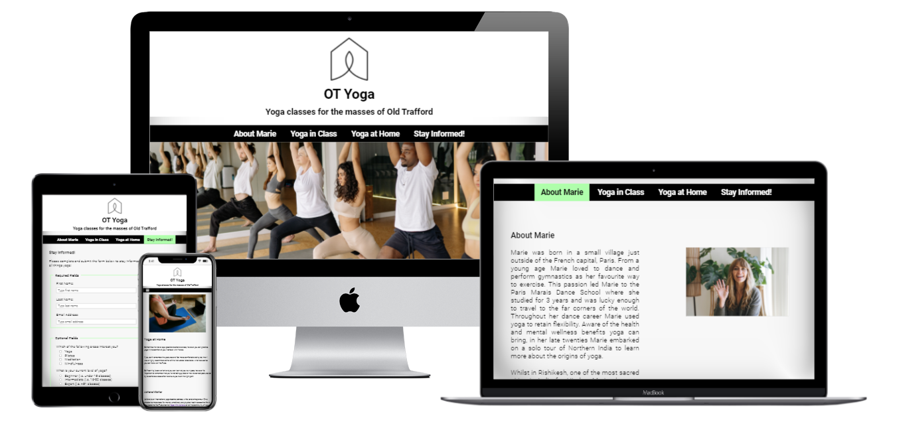
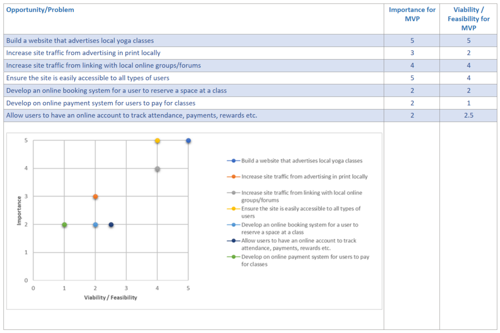
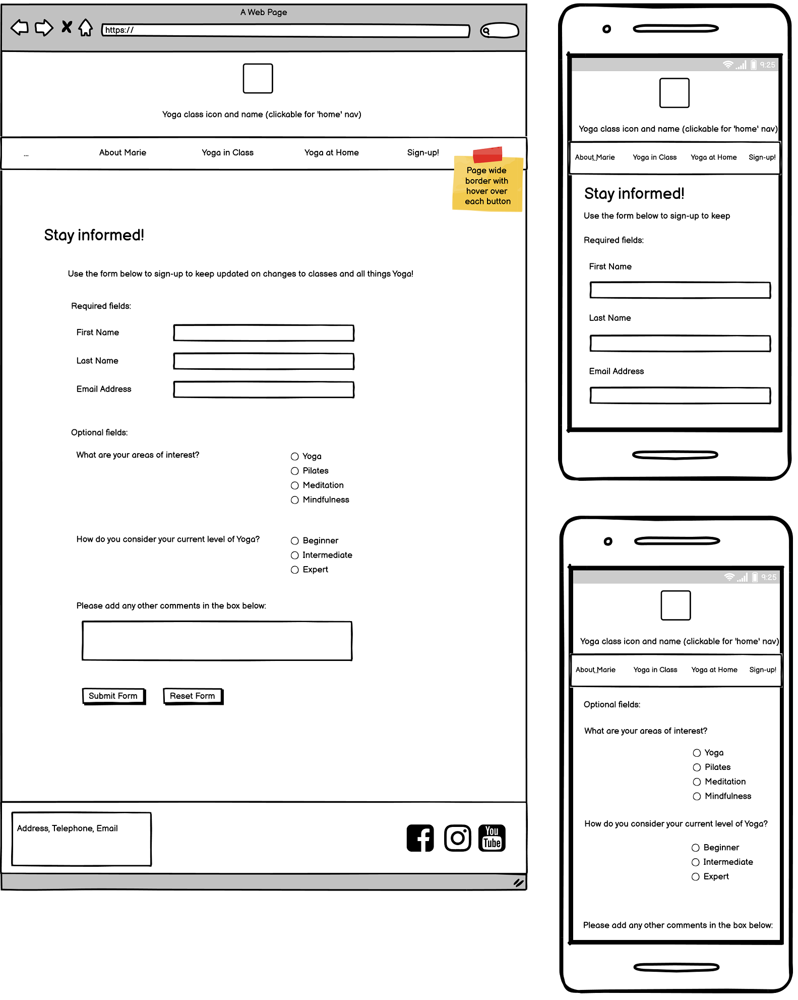
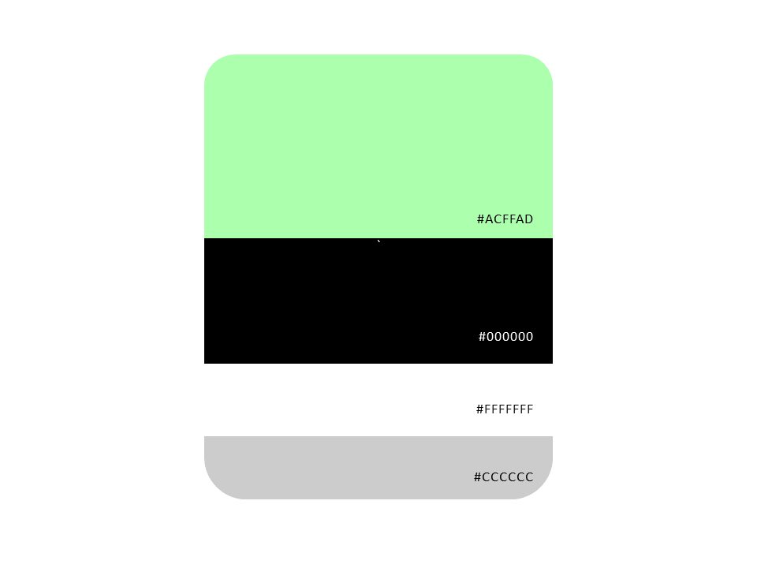

# OT Yoga

[Link to Live Website](https://rickofmanc.github.io/old-trafford-yoga/)

[GitHub Repo](https://github.com/RickofManc/old-trafford-yoga)

*** 

## About  

OT Yoga is a newly formed yoga class in Old Trafford, South Manchester. The classes have been established by Marie to guide people on stretching, energizing and relaxing as a community. The classes have become popular locally and so Marie would like to leverage this with an online presence where she can communicate to existing students and also increase the number of students attending. As well spreading positivity that yoga can bring into the community, an increase in attendees will help Marie fund the cost of the hiring the venue (which in turn supports other community projects).

***

## Index – Table of Contents

* [User Experience R&D](#user-experience-research-and-design)
     * [Strategy](#Strategy)
     * [Scope](#Scope)
     * [Structure](#Structure)
     * [Skeleton](#Skeleton)
     * [Surface](#Surface)
* [Features](#features)
* [Testing](#testing)
* [Deployment](#deployment)
* [Credits](#credit)

*** 

## User Experience Research and Design

### Strategy

The website will be targeted at all members of the community so accessibility in design is key as yoga can benefit anyone, no matter age or physically ability. The website should clearly inform students when and where classes occur, what to expect and bring. Should a student be unable to attend a class there will be a page to support learning at home.

#### Leading User Stories
* As a student with accessibility requirements, I want to intuitively navigate the website to learn all about OT Yoga, so that I can attend as part of regular exercise.
* As a student, I want to learn when and where yoga occurs in Old Trafford, so that I can attend as part of regular exercise.
* As a student, I want to learn how much a class costs and what I need to bring, so that I can be prepared when I attend a class.
* As a student, I want to learn what type of yoga is practiced, so I can understand if it will be something I would like to learn, or have practiced before.
* As a student, I want to learn about the instructor, so I can gauge whether we would get along.
* As a student, I would like to be kept informed of changes to classes, so I attend accordingly.

#### Primary strategic aims for the website
* Advertise yoga classes for the betterment of the local community.
* Advertise yoga classes to increase revenue to fund the cost of venue hire.
* Introduce a method for the instructor to communicate digitally with students.

The roadmap below highlights the high-level strategic opportunities versus the importance and viability/feasibility of development for the MVP (Minimal Viable Product):

### Scope

An agile approach of keeping the in scope features simple and aligned to the strategy for the MVP will be adopted.
Below is a list of the leading features for this website.

#### In Scope Features
* Homepage that clearly informs what the website represents and offers.
* A menu that intuitively navigates to the other website pages.
* Imagery from classes to help convey the aim of the website and individual pages.
* Provide information on; 
    * class days and time,
    * the venue and contact information,
    * the instructor,
    * types of yoga practiced,
    * feedback from current students,
    * sources for practicing yoga at home,
    * allow users to stay informed of changes to classes and other relating articles.

#### Out of Scope Features
* **Homepage hero image** change to a carousal style with a rotation of images containing links to articles on yoga and the benefits it can bring.
* **Online booking system** the current venue is a large church hall with no indication that a class could hit the maximum occupancy of 40 persons when the MVP is launched. As interest and attendees grow then consideration may need to be given to adding a page for users to reserve a space to avoid being disappointed if a class is full on arrival.
* **Online payment system** to follow or be developed in parallel with the 'Online booking system' users and the instructor could benefit from having a payment system to avoid handling cash. Users could also reserve several classes at a time.
* **User accounts** users may benefit from having an account where they can track class attendance, payments and potential rewards i.e. every 10th class attended is free.
* **eCommerce** page where users could purchase; yoga mats, towels, straps etc.

### Structure

This website will be structured with the following design considerations across 5 pages (including the homepage):
* The Information Architecture (IA) will follow a '3 Tier Hierarchical Tree Structure' approach.
* A homepage complete with horizontal navigation menu will welcome users. This will lead to pages for; About the Instructor, Yoga in Class, Yoga at Home and Stay Informed (sign-up page).
* The homepage header, navigation menu and footer will be consistent throughout the site. 
* To assist users, the homepage will display the essential information for the class days, times, type of yoga and cost. A button will be available to users to found out more information of what to expect when attending a class.
* To assist users, a map will be inset to the homepage so they can click through to help plan a route to attend a yoga class.
* Contact information and social media links will be located within the footer to support the strategic aim; Introduce a method for the instructor to communicate frequently with students.

### Skeleton

Key to this website being accessible to all members of the community is a simple design that is intuitive to navigate and clear to read. 
It is important to retain a clean and simple design throughout all pages to avoid confusing and ultimately marginalizing certain members of the community.

The homepage will be the hub of the website where essential information is displayed. To support the users journey there is a logical navigation menu that progressively reveals information in an order the user expects;
    * Who is teaching yoga? click 'About Marie'.
    * What can I expect or need to bring? click 'Yoga in Class'.
    * If I can't attend a class, can I practice at home? click 'Yoga at Home'.
    * How can I stay in touch with OT Yoga? click 'Stay Informed!'.

As part of this phase wireframes for all pages have been produced using [Balsamiq](https://balsamiq.com/wireframes/) (see samples below - all wireframes can be found within the [Repo](wireframes)). Consideration was given to both desktop and mobile users. The website is responsive through differing screen widths from  with the final design being responsive at screen widths from 320-640px, 980-1200px, 1200-1600px and 1600-5000px. This should ensure accessibility on any device or desktop monitor.

#### Homepage Wireframe 

#### Stay Informed! Wireframe

### Surface

In consideration that accessibility was a key design criteria, the developed visual language offers contrast using a simple colour palette, readable font and clear layout. Throughout the website this language has been applied consistently to promote intuitive behaviour with the most important links and information easily recognised.

#### Colour

[Color Hunt](https://colorhunt.co/) has been used to research for a palette that offers a high contrast to the primarily monochrome theme. As no single palette offered this, the colours found allowed me to create a palette unique for OT Yoga. The light and bright Green selected offers that contrast whilst also being neutral in it's appeal to all genders. This was a key to ensure all genders within the community felt welcome and comfortable to attend OT Yoga. 

#### Fonts

Research indicates The Proxima Nova font as a popular typography choice on websites praised for high levels of accessibility. With zero budget for the MVP, the shape and style of Proxima Nova was found using Roboto from Google's free font library. Roboto has been applied as the sole website font to promote a comfortable and consistent theme to users.

#### Images

To meet the timescales for the MVP, it wasn't feasible to produce class photography whilst also gaining permissions to satisfy General Data Protection Regulation (GDPR). Therefore a decision was taken to use free images from online sources to convey what the website represents. It was important for the images to communicate differing ages and genders practicing yoga as this represents an OT Yoga class well.

Images were sourced from [Pexels](https://pexels.com/) for the homepage and 'Yoga in Class' pages, whilst [RawPixel](https://rawpixel.com/) provided the images for the 'About Marie' and 'Yoga at Home' pages. All images have alt attributes and/or arial-label to support users with screen readers and the website ranking.

Where necessary images have been styled to display on differing devices with media queries width of up to 640px, 980-1200px, 1200-1600px and +1600px.

***

## Features

### Universal Features

##### Header & Navigation Menu

The centralized header element complete with OT Yoga logo and Navigation Menu (nav-menu) is a constant element throughout the website. The layout has been centrally aligned leading up to the logo which represent hands clasped, stretching up, incorporating into a house. This sense of home is aimed at providing a friendly comfortable feel. The logo and main header change colour when the user hovers over them, with a click on either intuitively returning the user to the homepage.

The responsive nature of elements changing colour when hovered over is maintained to the nav-menu where each page title changes on hover. In addition, the page title remains lit when a user visits that page to help inform where they are within the website.

For devices under 640px wide, the nav-menu reduces to a collapsible drop-down style, with menu options aligned to the left for ease of selection for the vast majority of users.

##### Footer 

The white font colour on black background theme of the nav-menu is carried through to the footer. This theme aims to be complimentary without distracting users from page content. The footers role on this website is to inform of how to contact, locate and socialise with OT Yoga. Therefore the footer has been divided into two sections; the left side is for contact information with responsive icons to support user navigation, and the right side is for the collection of social media buttons where users can click to find out more about OT Yoga. As with the nav-menu, the layout and fonts are styled appropriately for devices under 640px wide.

##### Meta data

To support the following strategic aims;
    * Advertise yoga classes for the betterment of the local community,
    * Advertise yoga classes to increase revenue to fund the cost of venue hire.
Meta data has been included within the websites HTML head element to increase the traffic to this website. Furthermore the individual site pages have been titled appropriately as another method of informing users where they have navigated to.

##### Redirection

A '404 Not Found' page has been added to the website in the event of a failed link or page. This page kindly informs the user of the error and provide a choice of where they would like to navigate to next. 

### Page specific features

##### Google Map iFrame

To assist new users in locating OT Yoga, a Google Map iFrame has been added to the homepage in parallel to the key information on when the classes occur. Text supporting the Map informs users they can click on the map to visit Google Maps and plan their journey to the venue.

##### FAQ's Vertical Accordion

With 11 questions available to inform users on attending a class, it was important to ensure the page wasn't overloaded with content which may result in users being deterred and not finding the answer to their question. With this is mind, the vertical accordion provides a concise list of the questions, with answers available as a drop-down when required. This format of FAQ's can be amended with relative ease as OT Yoga require changes to information.

##### Sign-up Form

To deliver the strategic aim of "Introduce a method for the instructor to communicate frequently with students", a page dedicated to inviting users to sign-up and stay informed of changes to classes has been created. The form requests only 3 basic mandatory fields (First Name, Last Name and Email Address) in attempt to encourage as many users to sign-up. Should users wish to provide more information, there are 4 optional questions which will help the OT Yoga understand more about those interested and/or attending classes.

### Future features

* Online booking system - as interest and attendees grow then consideration may need to be given to adding a page for users to reserve a space to avoid being disappointed if a class is full on arrival.
* Online payment system - to potentially be developed in parallel 'Online booking system', users and the instructor could benefit from having a payment system to avoid handling cash. Users could also block book for several classes at a time.
* User accounts - users may benefit from having an account where they can track class attendance, payments and potential rewards i.e. every 10th class attended is free.
* Online shopping - an eCommerce page where users could purchase yoga mats, towels, straps etc.

***

## Testing 

Throughout the Build phase Chrome Developer Tools are used to ensure all pages are being developed to remain intuitive, responsive and accessible across all device widths. Primarily the pages were designed at 1920px wide reducing to 320px for mobile devices. These tools and others were used for the Testing phase. Full details and results of this phase can be found within this document [ADD XLS TEST DOCUMENT LINK].

The following sections summarise the tests and results.

### Code

Code has been tested using the [HTML Validator](https://validator.w3.org/) and [CSS Validator](https://jigsaw.w3.org/css-validator/) with the following results:

* **index.html** - 0 Errors / 0 Warnings
* **about-marie.html** - 0 Errors / 0 Warnings
* **yoga-in-class.html** - 0 Errors / 0 Warnings
* **yoga-at-home.html** - 0 Errors / 0 Warnings
* **stay-informed.html** - 0 Errors / 0 Warnings
* **404.html** - 0 Errors / 0 Warnings
* **style.css** - 0 Errors / 1 Warning '::-webkit-details-marker is a vendor extended pseudo-element' - expected from using the Vertical Accordion from CodePen. CSS code is required for the functionality of the Vertical Accordion and therefore will remain as a known exception.

### Browser

To ensure site visitors can view and interact with OT Yoga's website, cross browser testing was performed on the test scenarios listed in the table below.

To achieve a 'Pass' the following criteria had to be met across all website pages;
1. All nav-menu links work as designed complete with hover feature
2. All images are loaded and displayed correctly at the differing media queries
3. All text uses 'Roboto' font style
4. All external links activate when clicked, and open in a new tab or browser window
5. The form as part of the 'Stay Informed!' page allows full completion and submission
6. Header elements can be clicked to return users to the homepage from any site page
7. All pages retain layout integrity throughout the Body and across the differing media queries
8. 404.html Page could be found and users can navigate back to the main website pages

| Browser                    | Version | Test Facility  | Pass | Partial Pass | Fail | Comments for Partial Pass and/or Fail                                                   |
| -------------------------- | ------- | -------------- | ---- | ------------ | ---- | --------------------------------------------------------------------------------------- |
| Internet Explorer          | 5.5     | Netrender.com  |     |              | [x] | Website could not render and therefore not loaded                                       |
| Internet Explorer          | 6       | Netrender.com  |     |              | [x] | Website could not render and therefore not loaded                                       |
| Internet Explorer          | 7       | Netrender.com  |     |              | [x] | Website could not render and therefore not loaded                                       |
| Internet Explorer          | 8       | Netrender.com  |     |              | [x] | Website could not render and therefore not loaded                                       |
| Internet Explorer          | 9       | Netrender.com  |     |  [x]       |      | Website loaded all text complete with CSS styles within 3s. Images and logo not loaded. |
| Internet Explorer          | 10      | Netrender.com  |     |  [x]       |      | Website loaded all text complete with CSS styles within 5s. Images and logo not loaded. |
| Internet Explorer          | 11      | ASUS Laptop   | [x] |              |      |                                                                                         |
| Microsoft Edge (Win 11)    | 96      | ASUS Laptop   | [x] |              |      |                                                                                         |
| Google Chrome (Win 11)     | 96      | ASUS Laptop   | [x] |              |      |                                                                                         |
| Firefox (Win 11)           | 95      | ASUS Laptop   | [x] |              |      |                                                                                         |
| Safari (macOS Mojave)      | 12      | lambdatext.com | [x] |              |      |                                                                                         |
| Opera (macOS Sierra 10.12) | 74      | lambdatext.com | [x] |              |      |                                                                                         |

### Device

To ensure site visitors can view and interact with OT Yoga's website on differing devices, testing was performed on the test scenarios listed in the table below.

To achieve a 'Pass' the following criteria had to be met across all website pages;
1. All nav-menu links work as designed complete with hover feature
2. All images are loaded and displayed correctly at the differing media queries
3. All text uses 'Roboto' font style
4. All external links activate when clicked, and open in a new tab or browser window
5. The form as part of the 'Stay Informed!' page allows full completion and submission
6. Header elements can be clicked to return users to the homepage from any site page
7. All pages retain layout integrity throughout the Body and across the differing media queries
8. 404.html Page could be found and users can navigate back to the main website pages

| Device       | Type               | Pass | Partial Pass | Fail | Comments for Partial Pass and/or Fail                                                                                                                                                    |
| ------------ | ------------------ | ---- | ------------ | ---- | ---------------------------------------------------------------------------------------------------------------------------------------------------------------------------------------- |
| Mobile Phone | iPhone SE          | ü    |              |      | Noted that paragraph text needed to increase slightly compared to other websites and space around main header content could reduce marginally to allow the hero image to be within sight |
| Mobile Phone | Samsung Galaxy S21 | ü    |              |      |
| Tablet       | iPad (2020)        | ü    |              |      |                                                                                                                                                                                          |
| Tablet       | iPad 3 (2012)      | ü    |              |      |                                                                                                                                                                                          |
| Laptop       | ASUS Zenbook 14"   | ü    |              |      |                                                                                                                                                                                          |

### Accessibility

Each page of this website has been tested with [Wave (Web Accessibility Evaluation Tool)](https://wave.webaim.org/) with the following errors and recommendations: 

* **Paragraph Text** alignment had been set to 'justify' to align with the overall block theme of the website. However, WAVE highlighted this style of alignment could prove challenging for some users with impaired vision. As a result, the text alignment has been changed to 'left' as recommended by WAVE.
* **Aria-labels** with the same focus were used on the header logo and text elements. WAVE highlighted this was unnecessary duplication. As a result, the header element has been rewritten so the aria-label encompasses all the header elements.
* **Collapsible nav-menu** element is without text. The HTML code uses a label element as the checkbox toggle for the burger style nav-menu on mobile devices. As such this produces a WAVE error. As recommended by WAVE, a title attribute has been added to the label element to ensure screen readers can inform of the elements purpose. However this hasn't cleared the error but can be considered acceptable according to WAVE.
 

### Performance

Using Lighthouse performance testing within Chrome Developer Tools, every pages performance has been tested on both Desktop and Mobile devices.

### User Stories

The leading user stories have been tested to ensure the priority aims of the website have been delivered. 
Below is a summary of the test results.

* As a student with accessibility requirements, I want to intuitively navigate the website to learn all about OT Yoga, so that I can attend as part of regular exercise.
    * All pages score a consistent 100% when tested for Accessibility with Lighthouse. In addition no errors are recorded when tested with [Wave (Web Accessibility Evaluation Tool)](https://wave.webaim.org/). This would suggest the site can be navigated by those with accessibility requirements and/or using a screen reader.

* As a student, I want to learn when and where yoga occurs in Old Trafford, so that I can attend as part of regular exercise.
    * The homepage offers this key information within one vertical scroll. Furthermore the venue address is consistently displayed in the Footer, and can also be viewed as part of the FAQ's on the 'Yoga in Class' page. 

* As a student, I want to learn how much a class costs and what I need to bring, so that I can be prepared when I attend a class.
    * From either clicking to the 'Yoga in Class' page or from clicking the 'More Info on Classes' button on the homepage, users can access the FAQ's section where both parts of information can be found. Additionally, the cost is displayed as part of the key information on the homepage, alongside the day of the class, start time and duration.

* As a student, I want to learn what type of yoga is practiced, so I can understand if it will be something I would like to learn, or have practiced before.
    * This information is clearly displayed on the homepage within one vertical scroll. It is located alongside the day of the class, start time and cost. Further information on how the instructor came to practice this form of yoga is naturally found on the 'About Marie' page which can be navigated to from the main nav-menu.

* As a student, I want to learn about the instructor, so I can gauge whether we would get along.
    * Information on instructor Marie can be found on a dedicated page titled 'About Marie'. A link to this page is constantly visible to users in the nav-menu located under the website header. Should a student wish to get in touch, contact details are provided in page and also within the Footer. Appropriate links have been provided for the convenience of the user to start a conversation either by phone, Whatsapp or social media.

* As a student, I would like to be kept informed of changes to classes, so I attend accordingly.
    * A sign-up form has been created on a dedicated page titled 'Stay Informed!' which should act as a call to action from the nav-menu. Users can be informed of changes in classes from completing just 3 mandatory fields. However should users wish they could complete a further 4 optional questions which will help OT Yoga provide further yoga relating information to support students.

### Bugs / Issues

*** 

## Deployment 

This project was deployed using the steps below with version releasing active. Please do not make any changes to files within this repository as any changes pushed to the main branch will be automatically reflected on the live website. Instead please follow the second set of steps which guide you to forking and cloning the website where changes can be made without impact to the live website. Thanks!

1. Logged into [my GitHub repository](https://github.com/RickofManc/old-trafford-yoga)
1. Clicked on the "Settings" button in the main Repository menu.
1. Clicked "Pages" from the left hand side navigation menu.
1. Within the Source section, clicked the "Branch" button and changed from 'None' to 'Main' in the dropdown menu.
1. The page automatically refreshed with a url displayed.
1. Tested the link by clicking on the url.

The live website can be found here https://rickofmanc.github.io/old-trafford-yoga/

To fork this website to either propose changes or to use as an idea for another website, follow these steps:
1. If you haven't yet, you should first set up Git. Don't forget to set up authentication to GitHub.com from Git as well.
1. Navigate to the [OT Yoga GitHub repository](https://github.com/RickofManc/old-trafford-yoga).
1. Click the 'Fork' button on the upper right part fo the page. It's in between 'Watch' and 'Star'.
1. You will now have a fork of the OT Yoga repository added to your GitHub profile. Navigate to your own profile and find the forked repository to add the required files.
1. Above the list of forked files click the 'Code' button.
1. A drop-down menu will appear providing a choice of cloning options. Select the one which is applicable to your setup.
Further details on completing the final step can be found on GitHubs ['Fork a Repo'](https://docs.github.com/en/get-started/quickstart/fork-a-repo) page.

***

## Credit

### People

* Mentor Brian Macharia for guiding and advising throughout the projects lifecycle.
* Anna Greaves and Rebecca Kelsall as sources of information for README content and layout.
* Code Institute Slack community for peer reviewing the website.

### Software & Web Applications

* [Balsamiq](https://balsamiq.com/) - Used to build wireframes in the Skelton phase. 
* This website was coded using HTML & CCS, with [GitPod](https://gitpod.io/) used for an IDE and [GitHub](https://github.com/) as a hosting repository. 
* Gitpod.io - for writing the code. Using the command line for committing and pushing to Git Hub
* [W3schools](https://www.w3schools.com/) - Source of 'How to...' information throughout the build.
* [Stack Overflow](https://stackoverflow.com/questions/42199911/how-can-i-reorder-html-using-media-queries) - Source of information on reordering HTML when using media queries.
* [FreeConvert](https://www.freeconvert.com/) - For compressing images to improve page load time.
* [Wave](https://wave.webaim.org/) - Accessibility Testing to ensure content is readable for all users.
* [HTML Validator](https://validator.w3.org/) - For validating HMTL code, no errors found.
* [CSS Validator](https://validator.w3.org/) - For validating CSS code, no errors found.
* [Code Beautify](https://codebeautify.org/) - For validating the layout of HTML and CSS code.
* [IE NetREnderer](https://netrenderer.com/index.php) - For testing website functionality on IE versions 5-10.
* [LambdaTest](https://www.lambdatest.com/) - For cross browser testing on macOS versions of Safari and Opera.

### Code

* [FAQs Vertical Accordion](https://codepen.io/frogmcw/pen/deqRwa) - Monica Wheeler's code for a Vertical Accordion in HTML & CSS only.
* [Collapsing Nav Menu](https://codepen.io/kevinpowell/pen/jxppmr) - Kevin Powell's code for creating a collapsible Navigation menu for mobile devices in HTML & CSS only.

### Content

* [Google fonts](https://fonts.google.com/) - For Roboto, the free family font used throughout the site.
* [Font Awesome](https://fontawesome.com/) - Free social media icons sourced from FA.
* [Pexels](https://pexels.com/) - Free images sourced from Pexels.
* [RawPixel](https://rawpixel.com/) - Free images sourced from Pexels.
* [Indian Yoga Association](https://www.indianyogaassociation.com/) - Source of information on yoga benefits and qualifications.
* [TriYoga](https://triyoga.co.uk/faqs/) - Source of information on yoga classes and general FAQs.

### Inspiration

* [Convince & Convert](https://www.convinceandconvert.com/digital-marketing/accessible-website-examples/) - Source of inspiration on design and features that improve accessibility which was key in reaching as many people in the Old Trafford community.
